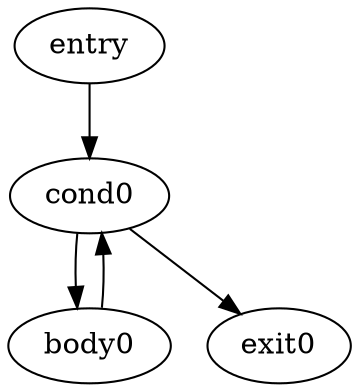

# Aether

Aether is a programming language for numerical and general-purpose computing.
This repository contains the language implementation, the official `aether`
CLI, and the optional Aether Studio desktop interface.

The active Aether workflow is intentionally focused:

- edit `.ae` scripts
- run programs with the `aether` CLI
- run complete scripts or selections
- use a persistent Aether REPL with the `aether>` prompt
- inspect the current Aether workspace
- choose a working directory for local files

MathTeX Studio is historical code, not an active Aether runtime. Its `.mtx`,
`.mtex`, `.mtn`, project, notebook, and PDF workflows are isolated under
[`legacy/`](legacy/). See
[`docs/legacy/README.md`](docs/legacy/README.md) for the retained components
and architecture boundary.

Compiler implementation notes live under
[`docs/compiler/`](docs/compiler/), including initial
[`dominator`](docs/compiler/DOMINATORS.md) and
[`SSA`](docs/compiler/SSA_DESIGN.md) design notes, plus the
[`SSA construction plan`](docs/compiler/SSA_CONSTRUCTION.md) and
[`general SSA builder plan`](docs/compiler/SSA_BUILDER.md), and the
[`SCCP design plan`](docs/compiler/SCCP.md), for future IR analysis and
optimization work. Language-level specifications and design notes live under
[`docs/aether/`](docs/aether/).

## Aether Scripts

Create or open `.ae` files from the Aether editor and run them with `Ctrl+Enter` or the Run button.

```aether
x = 2;
y = 3;
println(x + y);
```

Use `print(...)` or `println(...)` for visible output. Expression auto-printing is not part of Aether v0 yet.

Strings support Aether interpolation with `$expr$`:

```aether
n = 4;
println("n = $n$");
println("Precio: \$10");
```

## REPL

The lower console is backed by a persistent `AetherSession`.

```text
aether> x = 10;
aether> println(x);
10
```

Restarting the REPL clears the session state. Failed commands roll back without destroying earlier committed variables.

## Aether CLI

Install the project in editable mode to make the official `aether` command
available in the active Python environment:

```bash
python3 -m pip install -e .
```

Run a program directly:

```bash
aether examples/hello.ae
aether --backend=ast examples/hello.ae
```

The default command uses the production AST backend:

```text
Lexer -> Parser -> TypeChecker -> ASTBackend
```

`--backend=ast` is equivalent to the default.

An experimental IR backend is available for the current scalar function
subset:

```bash
aether --backend=ir program.ae
```

The IR backend uses:

```text
Lexer -> Parser -> TypeChecker -> IR lowering -> IR verifier -> IR interpreter
```

For now, IR file execution requires a zero-argument `main()` function. It is
not the default backend and does not support structs, classes, lists, advanced
imports, builtins such as `println`, or the full top-level scripting model yet.

Start a persistent session backed by `AetherSession`:

```bash
aether --repl
```

Language-development inspection tools are also available:

```bash
aether --tokens examples/hello.ae
aether --ast examples/hello.ae
aether --emit-ir program.ae
aether --emit-ir -O0 program.ae
aether --emit-ir -O1 program.ae
aether --emit-ir -O2 program.ae
aether --emit-ir --opt program.ae
aether --emit-ir --opt --show-passes program.ae
aether --emit-cfg program.ae
aether --emit-ssa program.ae
aether --emit-ssa --ssa-builder=pattern program.ae
aether --emit-ssa --ssa-builder=general program.ae
aether --emit-llvm hello.ae
aether build hello.ae
aether build hello.ae -o hello
aether build hello.ae --keep-llvm
aether --backend=ir --emit-ir program.ae
aether --backend=ir --emit-cfg program.ae
```

`--emit-ir` lowers and verifies the program, prints textual IR, and does not
execute it. Optimization profiles are compiler-style `-O` levels for emitted
IR only:

- `-O0` disables optimization and is equivalent to plain `--emit-ir`.
- `-O1` runs the current iterative optimizer pipeline.
- `-O2` is reserved for future stronger optimization and currently aliases
  `-O1`.

The long form `--opt-level=0`, `--opt-level=1`, or `--opt-level=2` is also
accepted. Existing `--opt` remains supported and is equivalent to `-O1`. For
`-O1`, `-O2`, and `--opt`, the CLI runs the optimizer to a fixed point, with a
default limit of 10 iterations to catch accidental non-convergence:

```text
Lexer -> Parser -> TypeChecker -> IR lowering -> IR verifier -> OptimizerPipeline -> IR verifier
```

Add `--show-passes` with `--emit-ir` and an optimization profile to print the
lowered IR, optimizer pass IR when the selected profile has passes, and the
final IR. With `-O0`, this prints only `Lowered IR` and `Final IR`. This is a
development inspection tool; the default optimized IR output remains unchanged
without `--show-passes`.

Optimizer pass headers include lightweight debug statistics. For example,
`[changed, folded=2]` means the pass changed the IR and folded two operations,
while `[no changes, removed=0]` means the pass left the IR unchanged. These
metrics are only for compiler-development inspection; they are not part of the
IR semantics and do not affect execution behavior.

The current optimizer pipeline includes constant folding, block-local constant
propagation, algebraic simplification, dead code elimination, and block-local
dead store elimination. The iterative pipeline does not add new optimizations;
it reruns these existing passes until a full iteration reports no changes or
the maximum iteration count is reached. Dead Store Elimination only removes
`IRStore`
instructions whose slot is not loaded again before another same-slot store or
before a returning block ends. It does not perform global liveness, alias,
escape, interprocedural, SSA, `if`, or `while` analysis; stores that may be
observed through `jump` or `branch` successors are preserved.

Optimization is currently connected only to `--emit-ir`. `--backend=ir` still
executes the verified, unoptimized IR, `--opt` without `--emit-ir` is rejected,
and `-O` flags without `--emit-ir` are rejected. `--show-passes` also requires
`--emit-ir` plus `--opt` or an explicit `-O`/`--opt-level`.

### Control Flow Graph

`--emit-cfg` lowers the checked program through the experimental IR path, builds
a basic-block control-flow graph for each lowered function, and prints Graphviz
DOT to stdout without executing a backend. Each basic block is a DOT node.
`IRJump` adds one edge, `IRBranch` adds true and false edges, and `IRReturn`
adds no edges.

For example:



This is development infrastructure for future SSA conversion, dominator
analysis, and loop analysis. It does not render PNG/SVG automatically and does
not add new optimizations.

### Static Single Assignment

`--emit-ssa` lowers the checked program through the experimental IR path,
verifies IR, builds the selected SSA form, verifies SSA, and
prints the exact textual SSA produced by the SSA printer:

```text
Lexer -> Parser -> TypeChecker -> IR lowering -> IR verifier -> selected SSA builder -> SSA verifier
```

For example:

```bash
aether --emit-ssa program.ae
aether --emit-ssa --ssa-builder=pattern program.ae
aether --emit-ssa --ssa-builder=general program.ae
```

This is an inspection mode for compiler development. SSA is not executed, is
not optimized, and does not replace the current slot IR or either execution
backend. The default `--emit-ssa` path now uses `GeneralSSABuilder`, the
CFG/dominator/dominance-frontier construction path. Explicit
`--ssa-builder=general` is equivalent to that default.
`--ssa-builder=pattern` remains available as a temporary compatibility and
comparison fallback. The pattern-based builder still supports linear functions
and simple acyclic `if`/`else` plus simple lowered `while` loops. The intended
future direction is to retire Pattern once comparison coverage stops adding
migration value. Unsupported CFG shapes report a clear SSA builder error.

### LLVM IR

`--emit-llvm` lowers the checked program through the General SSA builder,
verifies SSA, runs the SSA optimizer pipeline, and prints textual LLVM IR to
stdout:

```text
Lexer -> Parser -> TypeChecker -> IR lowering -> IR verifier -> GeneralSSABuilder -> SSA verifier -> SSAOptimizerPipeline -> LLVMBackend
```

For example:

```bash
aether --emit-llvm hello.ae
```

`--emit-llvm` remains an inspection mode: it prints LLVM IR to stdout and does
not write files.

For the currently supported LLVM subset, `aether build` can also invoke `clang`
to produce a native executable:

```bash
aether build examples/llvm/return_5.ae
aether build examples/llvm/return_5.ae -o return_5
aether build examples/llvm/return_5.ae -o return_5 --keep-llvm
```

When `-o`/`--output` is omitted, the executable is written under `build/`
using the source name without `.ae`; for example,
`examples/llvm/return_5.ae` produces `build/return_5`. With `-o return_5`,
the executable is written to `./return_5`. `aether build` creates any needed
output directories automatically. By default the generated `.ll` file is
temporary and removed after `clang` finishes. `--keep-llvm` keeps it next to the
executable output, for example `build/return_5.ll` for the default output path
or `return_5.ll` when using `-o return_5`.

Native builds require `clang` on `PATH`. The native build path is intentionally
small for now: no JIT, `llc`, runtime, `println` lowering, advanced imports,
aggregate LLVM lowering, complex linking, or cross-compilation.

The LLVM backend supports string literals as private global constants in
inspection/build IR. Aether `string` currently maps to LLVM `ptr`, and repeated
literal values are deduplicated within one emitted module. This is literal-only
support: there is still no string runtime, concatenation, comparison, printing,
length, indexing, mutation, or heap ownership model.

Small LLVM-native examples live under `examples/llvm/`:

- `return_5.ae` exits with `5`.
- `arithmetic.ae` exits with `23`.
- `max.ae` exits with `12`.
- `countdown.ae` exits with `0`.
- `sum_to_n.ae` exits with `15`.
- `gcd_iterative.ae` exits with `6`.
- `identity_call.ae` exits with `23`.
- `double_add.ae` exits with `17`.
- `double_compare.ae` exits with `19`.
- `int_to_double.ae` exits with `12`.
- `double_to_int.ae` exits with `14`.

Build and run one example with:

```bash
aether build examples/llvm/sum_to_n.ae -o build/sum_to_n
./build/sum_to_n
echo $?
```

The LLVM integration tests compile and execute these examples when `clang` is
available. If `clang` is missing, those native integration cases are skipped:

```bash
PYTHONPATH=src .venv/bin/pytest tests/test_llvm_integration.py
```

The CLI also includes a minimal benchmark harness for language and backend
development:

```bash
aether bench benchmarks/sum_to.ae
aether bench benchmarks/sum_to.ae --iterations 20
aether bench benchmarks/sum_to.ae --backend ast
aether bench benchmarks/sum_to.ae --backend ir
aether bench benchmarks/sum_to.ae --backend both
```

`aether bench` measures approximate wall-clock time with `time.perf_counter()`.
Each iteration includes frontend preparation plus the selected backend work.
The AST measurement executes the production AST path and calls zero-argument
`main()` when the benchmark defines one. The IR measurement lowers, verifies,
and executes with the current experimental IR interpreter. When IR is selected,
the harness also reports `IR O1 optimizer (not executed)`, which measures
lowering, verification, the current `-O1` optimizer pipeline, and verification
of the optimized IR. That optimized IR is still not used as the IR execution
backend.

This command is a development tool, not a rigorous performance suite. The
numbers are approximate and intended for local comparisons across backends or
profiles. If the IR backend cannot lower a benchmark and `--backend both` is
selected, the harness prints a clear IR error and still reports AST timing.

Use `aether --help` for all current options and `aether --version` for the
language version. The primary execution form is `aether file.ae`; there is no
`aether run` command.

The optional desktop application is available through:

```bash
python3 src/main.py
```

`python3 src/main.py --cli` starts the Studio text-mode REPL. The installed
`aether` command remains the primary command-line entrypoint.

## Repository Architecture

- `src/aether/`: language core, runtime, standard library, and official CLI.
- `src/aether_lsp/`: Aether language server support.
- `src/`: active desktop application and editor integration modules.
- `tests/`: active Aether, CLI, LSP, editor, and desktop tests.
- `examples/`: `.ae` programs for the active language.
- `benchmarks/`: small `.ae` programs for the development benchmark harness.
- `docs/aether/`: current language specification.
- `legacy/`: quarantined MathTeX Studio implementation, tests, examples, and
  historical documentation.

The active package configuration only discovers packages under `src/`, and
the main pytest configuration only collects `tests/`. Neither
`src/aether/` nor the `aether` CLI imports modules from `legacy/`.

## Development

Install dependencies:

```bash
python3 -m pip install -r requirements.txt
python3 -m pip install -e . --no-deps
```

Run the GUI:

```bash
python3 src/main.py
```

Run the main test suite from the project virtual environment:

```bash
PYTHONPATH=src .venv/bin/pytest
git diff --check
```

Technical language documents:

- [Aether v0 Language Specification](docs/aether/AETHER_V0_SPEC.md) describes
  the current language behavior.
- [Aether IR Initial Design](docs/aether/AETHER_IR_DESIGN.md) proposes a future
  typed intermediate representation and documents the experimental Python IR
  backend.

## Examples

Example Aether programs are located in the [examples/](examples/) directory, organized by category:

- **structs/** - Working with structs, methods, and interface implementation
- **linear_algebra/** - Vector and matrix operations
- **nonlinear_systems/** - Solving non-linear systems of equations
- **interactive/** - Examples requiring user input (not for automation)
- **minimos_cuadrados/** - Least-squares polynomial fitting

See [examples/README.md](examples/README.md) for details on each example.
