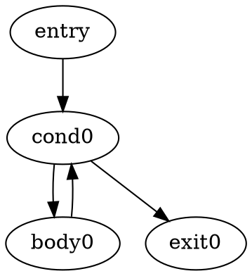

# Aether Intermediate Representation: Initial Design

## Status

This document is an initial design proposal for an Aether intermediate
representation (IR). It is not a final specification.

The purpose of this document is to establish a conservative direction while
adding lowering, an IR interpreter, optimizations, or backend work
incrementally. Exact instruction names, type spellings, serialization details,
and phase boundaries may change as the design is validated.

The current AST interpreter remains the executable semantic reference for
Aether throughout this work.

### Initial Python infrastructure

The `aether.ir` package now contains the initial typed IR data model, a
deterministic debug printer, an IR verifier, and a minimal IR interpreter in
Python. The default public execution path still uses the AST interpreter, but the
internal pipeline now has an explicit frontend/backend boundary: source is
tokenized, parsed, and typechecked into a checked program before a backend runs
it. The production and default backend is the AST backend. An experimental IR
backend is available for file execution through `aether --backend=ir`, but it
is intentionally narrow and is not the default. Initial IR optimization
infrastructure exists as an explicit developer API, but it is not connected to
the public IR backend path. There is no SSA, JIT, Rust backend, or full-language
IR execution path yet.

### Initial lowering implementation

`aether.ir.lowering.IRLowerer` lowers an already typechecked `ast.Program` to
an `IRModule`. It is an explicit developer API and is also used by the
experimental IR backend and `--emit-ir`. The main pipeline prepares the same
checked program boundary for both AST and IR backends, but IR lowering remains
an experimental backend concern and does not invoke the typechecker itself.

The initial scalar lowering subset includes:

- Top-level, explicitly typed function declarations.
- Typed parameters.
- Explicitly declared local variables with simple initializers.
- `int`, `boolean`, and `string` literals.
- Arithmetic `+`, `-`, `*`, `/`, and `%`.
- Comparisons lowered to `IRCompareOp`: ordered integer comparisons
  `<`, `<=`, `>`, and `>=`; equality comparisons `==` and `!=` for `int`,
  `boolean`, and `string`.
- Unary minus, currently lowered as a typed zero followed by `sub`.
- Assignment to already declared local variables and parameters, represented
  with mutable slots.
- Basic acyclic `if`/`else` control flow using `IRBranch`, `IRJump`, and
  deterministic block names such as `then0`, `else0`, and `merge0`.
- Basic `while` loops using cyclic control flow and deterministic block names
  such as `cond0`, `body0`, and `exit0`.
- Direct `return`, including bare return in `void` functions.
- Positional calls to user-defined functions in the same program when no
  implicit conversion is required.

Functions lower to one or more basic blocks. Parameters are direct IR values
until assigned; assigned parameters are copied into same-named mutable slots at
function entry. Local variables use named slots represented by `IRValue`, with
`IRStore` on declaration or assignment and `IRLoad` on reads. Expressions
produce numbered temporaries in deterministic source evaluation order.

Comparison results are always `bool` in IR and can feed `IRBranch`.

### Structural value lifecycle (implemented)

The pre-SSA IR now distinguishes immutable `IRValue` instances from owning,
addressable `IRStorage`. AST lowering emits `IRInitDefault`, `IRCopyInit`,
`IRMoveInit`, `IRAssign`, `IRDestroy`, and `IRRelocate` instead of encoding
ownership-changing actions as runtime calls. Operations retain their exact
nominal type and an optional source location.

`IRVerifier` runs a conservative forward data-flow analysis over each CFG. It
tracks definitely-live, moved, destroyed, and uninitialized storage, rejects
inconsistent branch merges, and requires cleanup on every return except the
one storage explicitly transferred to the caller. This is deliberately not a
borrow checker: parameters remain borrowed by convention and the analysis is
limited to compiler-produced owning slots.

The lowerer preserves lexical scopes and emits reverse-order cleanup on normal
scope exit, return, break, continue, branch exit, and loop iteration exit. A
direct local return uses `move_init`; returning a borrowed parameter or a
computed value creates an owned `copy_init` return slot. Struct traits and
field plans are synthesized recursively.

Lifecycle is verified and then expanded by `LifecycleExpander` at the standard
IR-optimizer/SSA boundary. Standalone IR passes still classify the structural
opcodes as mandatory effects and preserve them. For the current all-trivial
ABI expansion means load/store, semantic default construction, or no-op.
Consequently no string retain/release runtime, string ABI change, or extra
primitive LLVM code is introduced by this phase.

### Multi-module lowering (implemented)

Semantic analysis now exposes a `CheckedProgram` containing the root module,
all loaded `CheckedModule` values, stable `ModuleId`/`SymbolId` identities,
canonical paths, dependencies, declarations, visibility and resolved imports.
The backend never opens source files or resolves import strings.

Native uses a **combined IR module**: dependency declarations are emitted once
in dependency-first order, and semantic symbols receive deterministic names
derived from logical module/name/kind length prefixes. Absolute paths never
participate in mangling; root `main` and runtime ABI symbols remain unchanged.
This is smaller and safer than separate compilation while IR has no external
declaration model. A future per-module strategy can reuse the same semantic
identities and replace only this combination boundary.

The compiled subset includes free/void functions, structs, constructors,
methods, imported types and cross-module signatures through full/selective
imports and module/symbol aliases. Cycles remain frontend errors. Imported
globals/constants or executable top-level statements are rejected by the
native capability profile: implementing them requires explicit IR global
storage and a single-execution initialization policy.

Unsupported syntax raises a clear `IRBackendUnsupportedFeatureError` naming the
language feature or unsupported lowering case and includes a short summary of
the supported subset. Current limitations include:

- No `for`, `do`/`while`, `break`/`continue`, or non-while loop control flow.
- No structs, classes, interfaces, constructors, methods, or fields.
- Nullable values remain unsupported; lists/arrays and modules/packages have
  explicitly documented compiled subsets.
- No SSA conversion, phi nodes, or execution-time optimizations.
- No builtin calls, keyword arguments, or expression functions.
- No implicit conversion instructions.
- No optimizer integration with the backend, SSA, JIT, Rust backend, or full
  public IR execution path.

### Initial optimizer infrastructure

`aether.ir.optimizer.OptimizerPipeline` is the first optimization pipeline
object. `aether.ir.optimizer.build_optimizer_pipeline(level)` builds the
compiler-style optimization profiles used by the CLI: `O0` is a no-op pipeline,
`O1` is the current iterative pipeline, and `O2` is reserved for future stronger
optimization but currently aliases `O1`. Its default pass list currently runs
`aether.ir.optimizer.ConstantFolder`, then
`aether.ir.optimizer.LocalConstantPropagator`, then another
`aether.ir.optimizer.ConstantFolder`, then
`aether.ir.optimizer.AlgebraicSimplifier`, followed by
`aether.ir.optimizer.DeadCodeEliminator`,
`aether.ir.optimizer.DeadStoreEliminator`, and a final
`DeadCodeEliminator` cleanup, and it returns an optimized `IRModule` without
mutating the input module. Individual passes return an
`OptimizationResult(module, changed, stats)` so development tools can tell
whether a pass changed the IR and inspect simple pass-local counters. Existing
callers may still construct `OptimizationResult(module, changed)`; `stats`
defaults to an empty dictionary. `OptimizerPipeline.run(module)` preserves the
simple optimized-module API. `OptimizerPipeline(iterative=True,
max_iterations=10)` runs the same pass list repeatedly until a complete
iteration reports no changes. If the last allowed iteration still changes the
IR, the pipeline raises `OptimizationConvergenceError` rather than guessing
that it converged. `OptimizerPipeline.run_with_trace(module)` returns
`OptimizationTraceStep(label, module, changed, stats)` entries for the lowered
module, every pass result in order, and the final IR; iterative traces include
the iteration number in each pass entry. The CLI can run the iterative pipeline
for inspection with `aether --emit-ir -O1 program.ae` or the backward-compatible
`aether --emit-ir --opt program.ae`, and can show the per-pass trace with
`aether --emit-ir -O1 --show-passes program.ae`. Optimization is not connected
to IR execution yet. This infrastructure change does not add new optimization
passes.

The current pass statistics are:

- `ConstantFolder`: `folded`
- `LocalConstantPropagator`: `propagated`
- `AlgebraicSimplifier`: `simplified`
- `DeadCodeEliminator`: `removed`
- `DeadStoreEliminator`: `removed_stores`

These counters are development and debugging metrics only. They are not part of
the IR semantics, are not observable by Aether programs, and do not affect the
optimized module beyond the transformations the pass already performs.

### Control Flow Graph

`aether.analysis.cfg` contains the first CFG infrastructure for lowered IR:
`CFG`, `CFGNode`, `CFGEdge`, `CFGBuilder`, and `DOTPrinter`. The graph is
function-local and block-level. `CFGBuilder.build(function)` creates one node
per `IRBasicBlock` and derives edges only from the block terminator:

- `IRJump` produces one edge to its target.
- `IRBranch` produces one edge to the true target and one edge to the false
  target.
- `IRReturn` produces no outgoing edges.

The initial printer emits minimal Graphviz DOT:



This CFG is a development inspection and future-analysis structure for SSA
conversion, dominator analysis, and loop analysis. It deliberately does not
implement SSA, phi nodes, dominators, automatic Graphviz rendering, PNG/SVG
output, or new optimizations.

The implemented constant folding pass rewrites arithmetic and comparison
instructions to `IRConst` when both operands are already known constants:

- Arithmetic: `add`, `sub`, `mul`, `div`, `mod`, and the current lowering
  spelling `rem`.
- Comparisons: `cmp_lt`, `cmp_le`, `cmp_gt`, `cmp_ge`, `cmp_eq`, and
  `cmp_ne`.

For example:

```text
%0: int = const 2
%1: int = const 3
%2: int = add %0, %1
```

becomes:

```text
%0: int = const 2
%1: int = const 3
%2: int = const 5
```

and:

```text
%0: int = const 2
%1: int = const 5
%2: bool = cmp_lt %0, %1
```

becomes:

```text
%0: int = const 2
%1: int = const 5
%2: bool = const true
```

The pass deliberately does not perform algebraic simplification, call
evaluation, or division/modulo by zero evaluation. Constant propagation through
loads and stores is handled by the separate local pass described below.

The implemented local constant propagation pass rewrites `IRLoad` instructions
inside a single basic block when the loaded slot is known to contain a constant
from an earlier same-block `IRStore`. Stores are preserved. If the slot is later
stored with a non-constant value, the pass forgets the known constant for that
slot. If it is stored with another constant, the known value is updated.

For example:

```text
%0: int = const 5
store %x, %0
%1: int = load %x
return %1
```

becomes:

```text
%0: int = const 5
store %x, %0
%1: int = const 5
return %1
```

The pass is deliberately basic-block-local. It does not propagate constants
across `branch`, `jump`, merge blocks, loops, function boundaries, or any other
control-flow edge. Results of calls are treated as unknown unless a later pass
or explicit instruction has already materialized a constant value. It does not
perform copy propagation, common subexpression elimination, SSA conversion,
dominance analysis, or global constant propagation. Global constant propagation
remains future work.

The implemented algebraic simplification pass rewrites local integer binary
operations when one operand is a known identity or absorbing constant. The IR
does not currently have a copy/move instruction, so identity rewrites record a
temporary value replacement such as `%result -> %x` and then rewrite all uses of
`%result` in the function. Zero-producing rewrites replace the operation with
an `IRConst` using the original result value.

The initial integer rules are:

- `x + 0 -> x`
- `0 + x -> x`
- `x - 0 -> x`
- `x * 1 -> x`
- `1 * x -> x`
- `x / 1 -> x` only when the result type is the same as `x`
- `x * 0 -> 0`
- `0 * x -> 0`
- `x % 1 -> 0`
- `x rem 1 -> 0`

For example:

```text
%0: int = const 0
%1: int = load %x
%2: int = add %1, %0
return %2
```

becomes:

```text
%0: int = const 0
%1: int = load %x
return %1
```

and the subsequent dead code elimination pass can remove `%0` if it is no
longer used:

```text
%1: int = load %x
return %1
```

The pass deliberately does not simplify `x - x`, `x / x`, `x % x`, `x + x`,
boolean expressions, comparisons, floating-point operations, or integer
division cases where replacing the result with the left operand would change
the IR type. It does not perform constant propagation, copy propagation, common
subexpression elimination, SSA conversion, or interprocedural analysis.

The implemented dead code elimination pass removes pure instructions whose
result value is not used by any kept instruction in the same function. Its
initial pure instruction set is:

- `IRConst`
- `IRBinaryOp`
- `IRCompareOp`
- `IRLoad`

The pass marks values used by non-removable instructions such as `return`,
`store`, calls, and branch conditions, then follows those uses backward through
pure producers. It works per function, preserves basic blocks and control-flow
targets, and does not perform interprocedural analysis.

For example, after constant folding:

```text
func @main() -> int {
entry:
    %0: int = const 2
    %1: int = const 3
    %2: int = const 4
    %3: int = const 12
    %4: int = const 14
    return %4
}
```

becomes:

```text
func @main() -> int {
entry:
    %4: int = const 14
    return %4
}
```

The pass deliberately keeps `IRStore`, `IRCall`, `IRBranch`, `IRJump`, and
`IRReturn`. Calls are preserved even when their result is unused because the IR
does not model call purity yet, and stores/control-flow instructions are
observable or structural.

The implemented dead store elimination pass removes `IRStore` instructions
when the written slot is never loaded again in the same basic block before
being overwritten or before the block returns. It analyzes each basic block
independently and never reasons across control-flow edges.

For example:

```text
%0: int = const 5
store %x, %0
%1: int = const 8
return %1
```

becomes:

```text
%0: int = const 5
%1: int = const 8
return %1
```

and:

```text
store %x, %0
store %x, %1
%2: int = load %x
return %2
```

becomes:

```text
store %x, %1
%2: int = load %x
return %2
```

The pass keeps a store if a later same-block `IRLoad` reads that slot before
another store overwrites it. It also keeps stores before `IRJump` and
`IRBranch` terminators because a successor block, including `if`, merge, or
`while` loop blocks, may read the slot. It removes only `IRStore`
instructions; calls are preserved even if their result is later stored into a
slot whose store is removed. There is no global dead store elimination,
cross-block liveness, alias analysis, escape analysis, interprocedural
optimization, SSA conversion, or dedicated `if`/`while` analysis yet. The final
dead code cleanup in the default pipeline can remove pure values that become
unused after DSE deletes a store.

### Experimental IR backend and CLI

The official CLI accepts:

```bash
aether program.ae
aether --backend=ast program.ae
aether --backend=ir program.ae
aether --emit-ir program.ae
aether --emit-ir -O0 program.ae
aether --emit-ir -O1 program.ae
aether --emit-ir -O2 program.ae
aether --emit-ir --opt program.ae
aether --backend=ir --emit-ir program.ae
aether --emit-cfg program.ae
aether --backend=ir --emit-cfg program.ae
aether bench benchmarks/sum_to.ae
```

`aether program.ae` uses LLVM by default, `--backend=ast` selects the AST
interpreter, and `--backend=ir` uses the experimental IR pipeline:

```text
source -> lexer -> parser -> typechecker -> entry-point normalization
       -> IR lowering -> IR verifier -> IR interpreter
```

Entry-point normalization supplies a marked synthetic `main` for script-mode
entry files. If `main()` returns a scalar value, `IRBackend.run` stores it in
the returned runtime environment under `__ir_main_result`; the CLI propagates
an `int` result as its exit code without printing it. File output remains tied
to explicit language output constructs such as `print` and `println`.

`--emit-ir` lowers and verifies the checked program, prints deterministic
textual IR, and does not execute it. It is a development tool and is accepted
with or without `--backend=ir`. Plain `--emit-ir` uses `O0`; `--emit-ir -O0` is
equivalent and prints unoptimized IR.

`--emit-cfg` lowers the checked program, builds a CFG for each function, prints
Graphviz DOT, and does not execute a backend. It is accepted with any
`--backend` value because backend selection is ignored by inspection modes.
`--show-passes` remains specific to `--emit-ir` optimizer inspection and is
rejected with `--emit-cfg`.

`--emit-ir -O1` runs:

```text
source -> lexer -> parser -> typechecker -> IR lowering -> IR verifier -> OptimizerPipeline -> IR verifier -> print IR
```

The CLI uses `OptimizerPipeline(iterative=True, max_iterations=10)` for this
path. The optimizer repeats the existing pass list until a full iteration
reports no changes. If the tenth iteration still changes the IR, optimization
fails with a clear convergence error. The second verifier checks the optimizer
output before the textual IR is printed. `--emit-ir -O2` currently runs the same
pipeline as `-O1`; it is reserved as the future stronger optimization profile.
The long form `--opt-level=0`, `--opt-level=1`, or `--opt-level=2` is also
accepted. `--opt` remains supported as an alias for `-O1`. `--opt` and `-O`
flags are currently supported only with `--emit-ir`; using them without
`--emit-ir` is a CLI usage error. `aether --backend=ir program.ae` continues to
execute unoptimized IR for now.

`--emit-ir -O1 --show-passes` and `--emit-ir --opt --show-passes` run the same
optimizer pipeline and print sectioned textual IR for:

```text
Lowered IR
Iteration 1 / After ConstantFolder [changed, folded=2]
Iteration 1 / After LocalConstantPropagator [no changes, propagated=0]
Iteration 1 / After ConstantFolder [no changes, folded=0]
Iteration 1 / After AlgebraicSimplifier [no changes, simplified=0]
Iteration 1 / After DeadCodeEliminator [changed, removed=4]
Iteration 1 / After DeadStoreEliminator [no changes, removed_stores=0]
Iteration 1 / After DeadCodeEliminator [no changes, removed=0]
Iteration 2 / After ConstantFolder [no changes, folded=0]
...
Final IR
```

The repeated `ConstantFolder` and final `DeadCodeEliminator` are intentional
because they are part of the default pipeline. A second iteration is printed
only when an earlier iteration changed the IR and the optimizer needs to confirm
the fixed point. With `--emit-ir -O0 --show-passes`, the trace contains only
`Lowered IR` and `Final IR`, with no pass sections. `--show-passes` is valid
only together with `--emit-ir` plus `--opt` or an explicit `-O`/`--opt-level`;
it does not affect normal optimized IR output. The bracketed status and stats
are compiler-development diagnostics, not semantic IR content.

The user-facing supported IR backend subset is:

- functions
- local variables
- int/bool/string literals
- arithmetic
- comparisons
- if/else
- while
- simple user-defined function calls
- the documented struct and collection subsets
- combined multi-module declarations and cross-module calls
- typed capture-free top-level function references and indirect calls
- nominal payload-free enums, including constants, equality, phis and calls

The remaining broad exclusions include classes, interfaces, exceptions,
closures/lambdas/bound methods, native module globals/initialization, JIT, Rust
code generation, and the feature-specific gaps recorded in the capability
profile. Callable values are deliberately limited to user-defined top-level
functions with an exact structural signature; the IR uses `function_ref` and
`call_indirect` rather than an untyped address or string.
IR/SSA and their verifier/optimizer paths are connected to LLVM/native; the IR
interpreter remains a development backend with a narrower runtime surface.

The CLI also has a minimal development benchmark harness:

```bash
aether bench benchmarks/sum_to.ae
aether bench benchmarks/sum_to.ae --iterations 20
aether bench benchmarks/sum_to.ae --backend ast
aether bench benchmarks/sum_to.ae --backend ir
aether bench benchmarks/sum_to.ae --backend both
aether bench benchmarks/sum_to.ae --backend ssa
aether bench benchmarks/sum_to.ae --backend llvm
aether bench benchmarks/sum_to.ae --backend native
aether bench benchmarks/sum_to.ae --backend all
```

The harness uses `time.perf_counter()` for approximate wall-clock timings and
reports frontend, middle-end, codegen, and runtime categories. AST and IR
compilation are separate from execution. SSA construction/verification, SSA
optimization, LLVM emission, clang compilation, and native execution have
their own profiles. Native execution performs one untimed setup build and then
runs the same temporary executable for all measured iterations. See
`benchmarks/README.md` for the full measurement contract.

Benchmark output is for local compiler-development comparisons only; it is not
a stable performance format and there is no JSON output or advanced statistics
yet. If `--backend both` is selected and IR lowering rejects the program, the
harness prints the IR error clearly and still reports the AST timing.

The checked AST remains the existing immutable source AST rather than a new
annotated tree. For this subset, declaration, parameter, literal, and function
signature types provide the information lowering needs. Features that require
resolved per-expression metadata should not be added by duplicating the full
typechecker inside the lowerer.

### Initial IR interpreter implementation

`aether.ir.interpreter.IRInterpreter` executes an `IRModule` through the
explicit developer API `IRInterpreter(module).call(function_name, arguments)`.
The experimental `IRBackend` uses this API after verification and currently
calls zero-argument `main()` for CLI file execution. The current AST
interpreter is still Aether's default runtime and semantic reference.

The currently executable subset is:

- Functions selected by name, positional arguments, and a fresh local frame
  for every call.
- One or more basic blocks per function, starting at `entry`.
- `IRConst`, `IRLoad`, `IRStore`, `IRBinaryOp`, `IRCompareOp`, `IRCall`, and
  `IRReturn`.
- `IRBranch` and `IRJump` for conditional control flow, including basic
  `while` loops.
- Raw `int`, `boolean`, and `string` scalar values.
- `add`, `sub`, `mul`, `div`, and remainder operations. The interpreter
  accepts `rem`, emitted by the current lowering, and `mod` as an alias.
- `cmp_lt`, `cmp_le`, `cmp_gt`, `cmp_ge`, `cmp_eq`, and `cmp_ne` over the
  scalar types accepted by the current verifier.
- Calls between user-defined IR functions in the same module.
- Mutable local slots, including errors on loads before initialization.
- Value returns and bare `void` returns.

Execution reports explicit errors for missing functions, wrong arity,
uninitialized slots or values, unsupported instructions or binary operations,
division by zero, missing `entry` blocks, non-boolean branch conditions,
missing branch or jump targets, and non-void functions that finish without
returning a value.

`break`, `continue`, builtins, aggregates, optimization, and integration with
the production execution pipeline remain intentionally unsupported.

### Initial IR verifier implementation

`aether.ir.verifier.IRVerifier` validates an `IRModule` through the explicit
developer API `IRVerifier(module).verify()`. It returns the module unchanged on
success and raises `IRVerificationError` with a direct diagnostic on the first
inconsistency found. Like lowering and the IR interpreter, it is not connected
to public pipeline selection or CLI execution.

The initial verifier checks the executable subset currently represented by the
Python IR model:

- Unique function names, at least one block per function, and a required
  `entry` block.
- Unique parameter and block names within their owning function.
- Valid IR types on parameters, return types, instruction results, and slots.
- Terminator discipline: every block must end in `return`, `jump`, or
  `branch`, and no instruction may follow a terminator.
- Jump and branch targets must name existing blocks.
- Branch conditions must be `bool`.
- Parameters are defined at function entry; instruction results become defined
  after their instruction; uses must be definitely defined on all reachable
  paths processed by the verifier.
- Local slots are inferred from `store` destinations in the current model;
  loads from unknown slots or loads before a definitely preceding store are
  rejected. At merge points, a slot is considered definitely stored only if it
  was stored on every incoming path. At loop exits, the verifier does not try
  to prove that a loop body executes; values read after a `while` must be
  definitely stored before entering the loop.
- `IRBinaryOp` operand compatibility and declared result types for arithmetic.
- `IRCompareOp` operand compatibility and declared `bool` result types for
  ordered integer comparisons and equality over `int`, `boolean`, and
  `string`.
- Return values must match the function return type; non-void functions must
  return on all evident paths from `entry`.
- Calls must target functions in the same module, use the right arity, pass
  compatible argument types, and use a result type compatible with the callee's
  return type.

Builtins remain outside this initial verifier unless they are represented as
ordinary user functions in the module. Future IR instructions may add explicit
slot declarations or builtin call nodes; the verifier should then move from
slot inference to checking those declarations directly.

## 1. Goals

The Aether IR should:

- Separate the language frontend from execution and future backends.
- Give the typechecker a stable, typed output target below the source AST.
- Provide a suitable representation for simple, auditable optimizations.
- Prepare the architecture for a future core implemented partially or fully in
  Rust.
- Leave a path toward a future JIT without designing v1 around a JIT.
- Preserve the current interpreter as the semantic reference while the new
  execution path is developed.
- Be readable enough to inspect in diagnostics, tests, and a future `--ir` CLI
  mode.
- Allow incremental adoption over a deliberately small language subset.

The first success criterion is not performance. It is semantic agreement
between the existing interpreter and an interpreter over a small, well-defined
IR subset.

## 2. Proposed Pipeline

The long-term compilation and execution pipeline is:

```text
Source
  -> Lexer
  -> Parser
  -> AST
  -> TypeChecker
  -> Typed AST
  -> IR Lowering
  -> IR
  -> Optimizer
  -> Backend
```

In the first implementation phases, the backend would be an IR interpreter:

```text
Typed AST -> IR Lowering -> IR -> IR Interpreter
```

The existing path remains available in parallel:

```text
Typed AST -> Current AST Interpreter
```

“Typed AST” means the source AST plus the resolved type and symbol information
required by lowering. It does not require a new public syntax tree format in
the first phase. The eventual implementation may annotate the current AST or
produce a separate typed representation.

The optimizer is an explicit pipeline stage. It now has initial infrastructure
and a conservative constant folding pass, but correct lowering and execution
must not depend on optimization.

## 3. Initial Decisions

### 3.1 Typed IR

The IR is typed. Function parameters, return values, local storage, instruction
results, aggregate fields, and call signatures carry resolved IR types.

Type aliases should be resolved before or during lowering. The IR should
normally contain the canonical target type rather than the source alias name.
Source-level names may still be retained as optional debug metadata.

### 3.2 IR v1 is not SSA

IR v1 does not require Static Single Assignment form. Mutable source variables
can lower to typed local slots with explicit `load` and `store` operations.
This avoids requiring phi nodes while control-flow and mutation semantics are
still being stabilized.

Instruction results may still use single-definition temporary names such as
`%0` and `%1`. This is a convenient three-address notation, not a commitment
that the complete IR is SSA. Mutable local slots remain the source of state
across blocks.

SSA may be introduced later as:

- A separate optimized IR form.
- A transformation pass over the initial IR.
- An internal representation used only by a future backend.

The decision should be made after IR v1 has demonstrated semantic parity with
the current interpreter.

### 3.3 Textual and debuggable

The in-memory IR should have a deterministic textual form. The text form is
primarily intended for:

- Human inspection.
- Debugging lowering and optimization.
- Golden or snapshot tests in a future implementation phase.
- A future CLI inspection mode such as `aether --ir file.ae`.

The initial textual form is not required to be a stable interchange format.
Changing it during early implementation should not imply a language breaking
change.

### 3.4 Interpreter first

The first consumer of the IR should be an IR interpreter, not a JIT compiler.
This keeps the first validation loop small:

```text
source behavior
  == current AST interpreter behavior
  == IR interpreter behavior
```

JIT-specific constraints must not drive the initial instruction set.

## 4. Scope of IR v1

The initial executable subset should cover:

- Integer, floating-point, complex, boolean, string, and null literals where
  their types are already resolved.
- Local variable declaration, initialization, reads, and assignment.
- `const` local bindings as verified frontend information.
- Arithmetic expressions.
- Comparisons.
- Boolean operations.
- `if`/`else`.
- `while`.
- Simple functions with typed parameters.
- `return` with and without a value.
- Calls to simple Aether functions.
- Calls to a small, explicit set of simple builtins.
- Simple struct construction, field reads, field updates, copying, parameters,
  and return values.
- Simple class allocation and method/function calls using reference semantics.

The first implementation does not need to lower every currently implemented
Aether feature. “IR v1” names the first IR design family, not a requirement to
port the entire language in one change.

### 4.1 Candidate container extension

Basic `List<T>` and `Array<T>` support is reasonable as a later IR v1 extension
after scalar control flow, calls, structs, and basic class references work.
That extension may add:

- Container construction.
- Length queries.
- Element reads.
- Element writes.
- A small set of explicitly mutating list operations.
- Shallow container copy.

`Vector<T>` and `Matrix<T>` may follow through typed builtin operations rather
than a large set of specialized instructions. Their exact lowering should be
decided only after the basic call and container model is proven.

Container support is not a prerequisite for the first executable IR subset.

## 5. Explicitly Outside IR v1

The following are not goals for IR v1:

- JIT compilation.
- LLVM integration.
- MLIR integration.
- GPU code generation.
- Parallel execution.
- Advanced optimization pipelines.
- ORM or database facilities.
- Large scientific package integration.
- User-defined properties.
- Class inheritance.
- Function, method, or constructor overloads.
- User-defined generics.

Builtin parameterized types such as `List<int>` do not imply support for
user-defined generics.

This exclusion list limits the first IR effort; it does not reject these
features permanently.

## 6. IR Type Model

The initial type model should be able to represent the following semantic
categories:

| Proposed IR spelling | Meaning |
|---|---|
| `int` or `i64` | Aether integer value |
| `f32` | Aether `float` value |
| `f64` | Aether `double` value |
| `complex` | Aether complex value |
| `bool` | Aether `boolean` value |
| `string` | Aether string value |
| `void` | No returned value |
| `nullable<T>` | Either `T` or `null` |
| `list<T>` | Mutable variable-length builtin container |
| `array<T>` | Mutable fixed-length builtin container |
| `vector<T>` | Mathematical vector with element type `T` |
| `matrix<T>` | Mathematical matrix with element type `T` |
| `struct Name` | Named value type |
| `class Name` | Reference to a named class instance |
| `interface Name` | Interface-typed value or dispatch reference |
| `enum Name` | Named enum value |

Implemented enums carry the collision-free semantic declaration name plus the
ordered variant table in `EnumType`. `IREnumConstant` records enum name, member
name, member id, and discriminant. Verifiers reject unresolved enum types,
invalid members/discriminants, enum/int mixing, cross-enum comparisons, and
phis with different nominal types. LLVM alone erases the representation to
`i32`; frontend IR and SSA never do.

These spellings are provisional. In particular, the implementation may choose
`i64` instead of `int`, `boolean` instead of `bool`, or explicit forms such as
`classref<Name>`. The first implementation should favor consistency and
readability over prematurely freezing syntax.

Additional internal types may eventually be necessary, for example:

- A distinct null literal type used only during validation.
- Function signatures.
- Runtime handles for strings and containers.
- Opaque builtin or external values.

Those types should be added only when lowering or execution requires them.

### 6.1 Source types and canonical IR types

The lowering layer owns the mapping from checked Aether types to canonical IR
types. Examples:

```text
Aether int          -> IR int (or i64)
Aether float        -> IR f32
Aether double       -> IR f64
Aether boolean      -> IR bool
Aether T?           -> IR nullable<T>
Aether List<T>      -> IR list<T>
Aether Point struct -> IR struct Point
Aether Counter class -> IR class Counter
```

The typechecker remains responsible for assignability, overload-independent
call resolution, visibility, nullability rules, and other source-language
semantic checks. Lowering should consume those decisions rather than recreate
the typechecker.

## 7. Values and Instructions

The IR should use a compact three-address form. A function contains named basic
blocks. Instructions may produce typed temporaries, and mutable locals are
represented by typed slots.

The examples below illustrate direction, not final syntax.

### 7.1 Simple arithmetic function

Aether source:

```aether
int add(int a, int b) {
    return a + b;
}
```

Possible IR:

```text
func @add(%a: int, %b: int) -> int {
entry:
    %0: int = add %a, %b
    return %0
}
```

### 7.2 Local variables and assignment

Aether source:

```aether
int next(int value) {
    int result = value;
    result = result + 1;
    return result;
}
```

Possible non-SSA IR:

```text
func @next(%value: int) -> int {
entry:
    local %result: int
    store %result, %value
    %0: int = load %result
    %1: int = add %0, 1
    store %result, %1
    %2: int = load %result
    return %2
}
```

`local` declares function-local storage. The exact operand order for `load`
and `store` remains open, but it must be consistent and type-checkable.

### 7.3 Conditional control flow

Aether source:

```aether
int absValue(int x) {
    if x < 0 {
        return -x;
    } else {
        return x;
    }
}
```

Possible IR:

```text
func @absValue(%x: int) -> int {
entry:
    %0: bool = lt %x, 0
    branch %0, negative, nonnegative

negative:
    %1: int = neg %x
    return %1

nonnegative:
    return %x
}
```

An `if` whose branches assign a value used later can use a mutable local slot
in IR v1 rather than a phi node:

```text
func @choose(%condition: bool, %a: int, %b: int) -> int {
entry:
    local %result: int
    branch %condition, then, else

then:
    store %result, %a
    jump merge

else:
    store %result, %b
    jump merge

merge:
    %0: int = load %result
    return %0
}
```

### 7.4 While loop

Aether source:

```aether
int sumTo(int n) {
    int i = 1;
    int total = 0;

    while i <= n {
        total = total + i;
        i = i + 1;
    }

    return total;
}
```

Possible IR:

```text
func @sumTo(%n: int) -> int {
entry:
    local %i: int
    local %total: int
    store %i, 1
    store %total, 0
    jump loop.condition

loop.condition:
    %0: int = load %i
    %1: bool = le %0, %n
    branch %1, loop.body, loop.exit

loop.body:
    %2: int = load %total
    %3: int = load %i
    %4: int = add %2, %3
    store %total, %4
    %5: int = load %i
    %6: int = add %5, 1
    store %i, %6
    jump loop.condition

loop.exit:
    %7: int = load %total
    return %7
}
```

### 7.5 Candidate instruction families

The first instruction set may contain:

- Constants and typed literal values.
- `local`, `load`, and `store`.
- Numeric operations such as `add`, `sub`, `mul`, `div`, `neg`.
- Comparisons such as `eq`, `ne`, `lt`, `le`, `gt`, `ge`.
- Boolean operations such as `not`, `and`, and `or`, with short-circuiting
  lowered to control flow when required.
- Conversion instructions for conversions already approved by the
  typechecker.
- `call` for Aether functions.
- `call_builtin` or resolved builtin calls.
- `make_struct`, `get_field`, and `set_field` or equivalent aggregate
  operations.
- `new_class`, class field operations, and resolved method calls.
- `branch`, `jump`, and `return`.

Instruction names and granularity are intentionally not fixed here. For
example, builtins may use ordinary calls to names in a reserved namespace
instead of a distinct `call_builtin` opcode.

## 8. Control Flow

IR v1 uses explicit control flow.

### 8.1 Basic blocks

A basic block is a labeled sequence of instructions with:

- One entry point.
- No internal branch target.
- Exactly one terminator.

The first block in a function is conventionally named `entry`.

### 8.2 Labels

Labels identify branch and jump targets within one function. They are not
runtime values and are not visible to Aether source code.

### 8.3 Terminators

The initial terminators are:

```text
branch %condition, true_label, false_label
jump target_label
return
return %value
```

Every reachable block must end in a terminator. A conditional branch requires
a `bool` condition. A non-void function must return a value of its declared
type along every reachable return path; this should already be guaranteed by
frontend semantic analysis and may also be validated by the IR verifier.

Short-circuit boolean expressions should lower to blocks and branches when
evaluating the right-hand side conditionally is semantically observable.

## 9. Mutability and Memory Model

IR v1 should make mutation visible without attempting to model machine memory
or object layout.

### 9.1 Local variables

Mutable local variables lower to typed local slots. Reading a variable emits a
`load`; assignment emits a `store`.

An implementation may avoid a slot for an immutable temporary or parameter
when doing so preserves behavior, but the unoptimized lowering should favor a
simple and uniform model over cleverness.

### 9.2 Constants

Source `const` is primarily a frontend restriction. The typechecker rejects
rebinding and mutation through a constant-rooted expression before lowering.

The IR may retain a `const` flag on local slots or debug metadata so that an IR
verifier can detect invalid stores, but runtime enforcement should not be the
primary source of `const` semantics.

### 9.3 Structs

Structs are value types. IR operations must preserve the current semantics:

- Assignment copies a struct value.
- Passing a struct argument copies the value.
- Returning a struct produces an independent value.
- Updating a field of one struct variable does not mutate a previously copied
  struct variable.

The initial interpreter may represent a struct with a high-level aggregate
value. The IR does not need to choose a native memory layout in v1.

### 9.4 Classes

Classes are references. IR operations must preserve the current semantics:

- Assignment copies a reference.
- Passing or returning a class value copies the reference.
- Mutation through one mutable alias is visible through other aliases.
- Allocation creates a distinct class instance.

The initial representation may use opaque managed references owned by the IR
interpreter. Object layout, garbage collection, and ABI decisions are backend
concerns and should not be frozen by IR v1.

### 9.5 Lists and arrays

Lists and arrays are mutable container values with shallow copy operations.
Their eventual IR representation should distinguish:

- Copying or aliasing the container value according to current Aether
  semantics.
- Mutating an element or list structure.
- Creating a new shallow container through `copy`.

Container mutation should remain explicit in calls or instructions so later
optimization passes do not incorrectly treat it as pure.

### 9.6 Shallow `const`

Aether's current `const` is shallow and access-path based:

- A constant name cannot be rebound.
- Mutation through that constant-rooted expression is rejected.
- A mutable alias may still mutate the same class instance or container.
- `const` does not globally freeze an object graph.

Lowering and optimization must not reinterpret source `const` as deep
immutability or universal non-aliasing.

## 10. Relationship to the Current Interpreter

The current AST interpreter remains the semantic reference while the IR path
is experimental.

The IR interpreter should be validated by running the same accepted programs
through both paths and comparing:

- Produced values.
- Printed output.
- State changes.
- Struct copy behavior.
- Class alias behavior.
- Container mutation where supported.
- Runtime errors and their semantic category.

Exact internal exception text does not need to be coupled permanently, but
observable language behavior should agree.

Existing tests should be reusable wherever their feature set is supported by
the IR. During migration, tests may classify programs as:

- Supported by both interpreters and required to agree.
- Supported only by the current interpreter because lowering is incomplete.
- Frontend errors that never reach either interpreter.

The default CLI execution path should not switch to the IR interpreter until
the relevant subset has strong parity. The current interpreter must remain
available as a reference and fallback during development.

## 11. Initial Optimization Opportunities

Once unoptimized IR execution is correct, small local passes may include:

### 11.1 Constant folding

Evaluate operations whose operands are compile-time constants:

```text
%0: int = add 2, 3
```

may become:

```text
%0: int = const 5
```

Folding must use Aether's numeric and error semantics, not the host language's
behavior by accident.

### 11.2 Simple dead code elimination

Remove unused pure instruction results and unreachable blocks when doing so
cannot discard observable behavior. Calls, mutations, allocations, and
potential runtime errors require conservative treatment.

### 11.3 Basic algebraic simplification

Examples may include:

```text
x + 0 -> x
x * 1 -> x
not (not x) -> x
```

Rules must be type-specific and safe for Aether's floating-point, complex, and
error semantics.

### 11.4 Trivial temporary elimination

Remove redundant loads, copies, or forwarding temporaries within a block when
aliasing and mutation cannot change the result.

### 11.5 Type specialization

Resolve generic-looking builtin operations to type-specific operations after
types are known, for example selecting integer addition, `f32` addition, or
`f64` addition. This is IR specialization based on resolved types, not
user-defined generics.

Optimization should be optional, deterministic, and independently testable.
The unoptimized IR must remain executable.

## 12. Migration Plan

### Phase 1: Design document

- Establish the initial goals, scope, type model, control flow, and migration
  constraints.
- Keep all existing execution behavior unchanged.

### Phase 2: Python IR structures and simple lowering

- Added typed in-memory IR structures in Python.
- Added lowering for the initial scalar function subset documented above.
- Added functions, entry blocks, calls, locals, and return terminators.
- Added a deterministic IR pretty-printer and lowering tests.
- Consider a developer-only inspection surface after the format is useful.

### Phase 3: Small-subset IR interpreter

- Added execution for scalar constants, integer arithmetic, mutable local
  slots, calls, and returns in a single `entry` block.
- Added direct tests for hand-built and lowered IR, semantic comparisons
  against the current AST interpreter, and runtime error cases.
- Comparisons and control flow remain future work.
- Keep the current interpreter as the default execution path.

### Phase 4: Dual-path validation

- Run simple existing tests or equivalent programs through both interpreters.
- Compare values, output, mutations, and runtime failures.
- Expand lowering only when the existing subset is stable.

### Phase 5: Simple optimization passes

- Add constant folding.
- Add conservative dead code elimination.
- Add basic algebraic and temporary simplifications.
- Verify optimized and unoptimized IR produce identical behavior.

### Phase 6: Evaluate partial Rust migration

- Measure which stable boundaries are suitable for Rust.
- Consider moving IR data structures, verification, optimization, or execution
  independently.
- Preserve a clear compatibility boundary with the frontend and semantic
  reference.

This phase is an evaluation point, not a commitment to rewrite the complete
language core.

## 13. Risks and Guardrails

### Do not port the whole language at once

Attempting full feature parity in the first IR implementation would make
semantic regressions difficult to isolate. Begin with scalar expressions and
control flow, then expand by coherent feature groups.

### Do not build a JIT before the IR is stable

A JIT would add code generation, ABI, memory-management, and platform concerns
before the language-to-IR contract is proven. The IR interpreter should
validate that contract first.

### Do not mix IR work with new language features

The first lowering work should represent existing, specified behavior. Adding
new syntax or semantics at the same time would make it unclear whether defects
belong to the frontend, the IR, or the runtime.

### Do not break or remove the current interpreter

The current interpreter is the executable semantic reference and the safest
comparison point. It should remain operational throughout migration.

### Avoid premature backend commitments

IR v1 should not encode LLVM, MLIR, machine ABI, object layout, garbage
collection, or Rust ownership details unless required by Aether semantics.

### Keep source semantics above backend convenience

Struct value behavior, class reference behavior, shallow `const`, nullability,
numeric conversions, evaluation order, and observable runtime errors must not
change merely because a backend representation makes another behavior easier.

## 14. Open Questions

The following decisions should remain open until implementation experience
provides evidence:

- Whether the canonical integer spelling is `int` or `i64`.
- Whether builtin calls need a distinct opcode or a reserved function
  namespace.
- Whether mutable locals are explicit slots in all unoptimized IR or only when
  their address-like identity is needed.
- How source locations and source variable names attach to instructions.
- Whether interface values use a pair of object reference and dispatch table,
  an opaque runtime handle, or another high-level representation.
- Whether exceptions eventually become explicit control-flow edges or remain
  interpreter/backend behavior.
- Whether the optimized IR becomes SSA while the lowering IR remains
  non-SSA.
- Which container operations belong in IR v1 extensions.
- Which stable IR components, if any, should be migrated to Rust first.

These questions do not block Phase 1. They are intentionally deferred so the
first implementation can stay small and evidence-driven.
